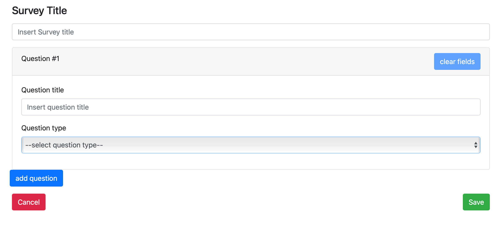
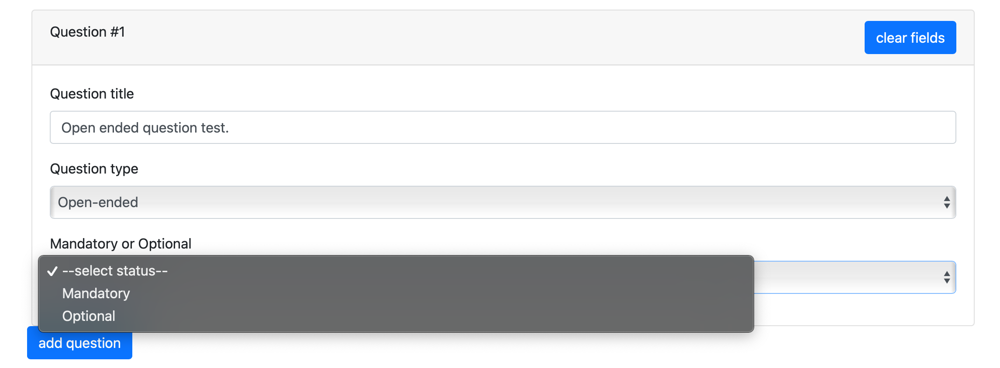
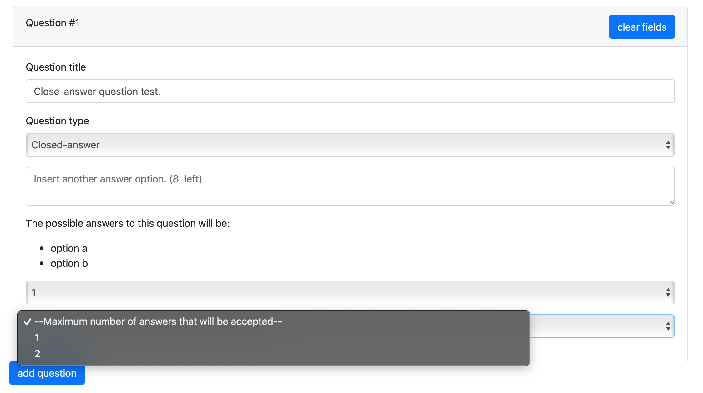

# Exam #1: "Survey"
## Student: s280238 TIMUTA ROSTISLAV  

## React Client Application Routes

- Route `/` => Redirect to /Main
- Route `/Main`: User side => Shows all surveys available and allows users to fill out them. 
Admin side => Shows personal surveys and allows admins to create a new surves and create new ones.

- Route `/Create-a-new-survey`: protected by authentication and allows admins to create new surveys.
- Routes `/fill-out-survey/:sid`: allow users to respond to survey with id = sid
- Routes `/View-responses/:rid`: protected allow admins to navigate through responses of the clicked survey ( 0<=rid < nResponse where nResponses is the total responses to a specific survey);
- Route `/login`: allows the authentication through a form.


## MAIN API Server

- POST `/api/surveys`
  - request parameters and request body content:
    all components of the surveys: survey specifications, its questions and relatives closed answers if any

``` JSON
[{
    "survey":{"sid":1, "adminId":1, "title": "whater consumption", "nResponses":0},
    
    "questions":[{"qid":1, "sid":1, "title":"How many times do you wash your hands a day?", "min":1, "max":, "position":1},
                 {"qid":2, "sid":1, "title":"How long it takes you to take a shower?", "min":0, "max":, "position":2},
                 {"qid":3, "sid":1, "title": " Do you consider some alternatives to reduce the consumption of water? Which ones?", "min":0, "max":null, "position":3}
                 {"qid":4, "sid":1, "title":"In which occasion did you receive some information on this topic?", "min":1, "max":null, "position":4}],

    "closedAnswers": [{"qid":1, "title":"between 5 and 10", "sid":1},
                      {"qid":1, "title":"between 10 and 15", "sid":1},
                      {"qid":1, "title":"more then 15", "sid":1},
                      {"qid":1, "title":"less then 5", "sid":1},
                      {"qid":2, "title":"more then 15 minutes", "sid":1},
                      {"qid":2, "title":"between 10 and 15 minutes", "sid":1},
                      {"qid":2, "title":"between 10 and 15 minutes", "sid":1},]
}]
```

- GET `/api/surveys` : a list of all surveys from surveys table

``` JSON
[{
  "sid": 1,
  "adminId": 1,
  "title": "Water consumption",
  "nResponses": 0},
  
  ...
]
```

- GET `/api/filteredQuestions/:sid` : a list of questions of survey with sid=sid

``` JSON
[{
  "qid":1,
  "sid":1,
  "title": "How many times do you wash your hands a day?",
  "min":1,
  "max":1,
  "position":1
}
...
]
```


- GET `/api/filteredClosedAnswers/:sid` : a list closed answer-options of questions of survey with sid=sid

``` JSON
[{
  "aid":1,
  "qid":1,
  "title": "between 5 and 10",
  "sid":1,
}
...
]
```


-POST `/api/responses/` : add a new response. Description of the response

``` JSON
{
  "sid": ,
  "answers": [{"sid": , "qid": , "ans"},
                {"sid": , "qid": , "ans"},
                {"sid": , "qid": , "ans"},
                {"sid": , "qid": , "ans"}]
}

```

- GET `/api/responses/:sid` gets all responses of survey with id = sid
*request parameters and request content: sid (id of survey) that needs responses
*response body: array of objects describing sigle responses
(sid inside is not necessary. I left it because near deadline. have no more time for changes. please understand)
first answer in answers is the name of the user.
qid is the id of the question. ans is the id of the closed answers or the open answer.

``` JSON
[{
  "sid":1,
  "answers":[{"sid":, "qid":, "ans":},
            {"sid":, "qid":, "ans":},
             {"sid":, "qid":, "ans":},
             {"sid":, "qid":, "ans":}]}
, ...
]
```

## Database Tables

- Table `administrators` - contains `id`, `username` and `password`
- Table `surveys` - contains `sid`, `adminId`, `title` and `nResponses`
- Table `quesitons` - contains `qid`, `sid`, `title`, `min`, `max` and `position`
- Table `closedAnswers` - contains `aid`, `qid`, `title` and `sid`
- Table `responses`- contains `rid`, `sid`, `answers`
 
## Main React Components

- `SurveyForm` (in `SurveyForm.js`): Create a new survey.
- `ResponseForm` (in `ResponseForm.js`): Allows a user to fill out a survey and allows an admin to review responses.
- `QuestionForm` (in `QuestionForm.js`): Allows the creation of a question in SurveyForm.
- `QuestionComponent` (in `QuestionComponents`): Allows the visualization of a question in SurveyForm and ResponseForm
- `LoginForm` (in `LoginComponents`) : Allows an admin to authenticate and proceed in admin's area.


## Screenshot





## Users Credentials

- username: `admin1`, password: `password1`
- username: `admin2`, password: `password2` 
